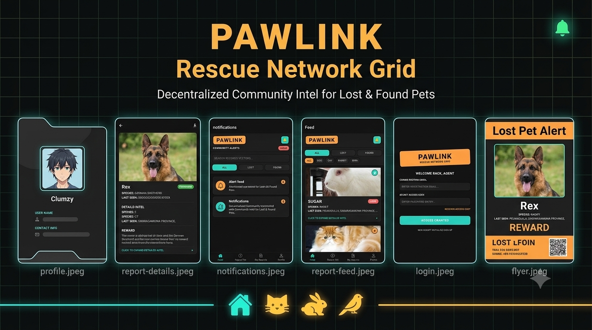

# 🐾 PawLink

**PawLink** is a cross-platform mobile app (built with Expo + React Native) that helps communities report, discover, and reunite with lost or found pets. Users can post a lost/found report with a photo, pin the exact location on an interactive map, get nearby alerts, generate a printable "missing pet" flyer, and message finders/owners directly — all backed by Firebase.

> Built as a final coursework project for an Advanced Mobile Development (AMD) module.

<!--
📸 SCREENSHOT: Add a hero banner/collage image here showing 3–4 key screens side by side
   (e.g. Home Feed, Report a Pet form with map, Report Details, Profile).
   Recommended size: a wide 1200x600 collage, saved as assets/screenshots/banner.png
   Example markdown once you have the image:
   
-->

---

## 📋 Table of Contents

- [Overview](#-overview)
- [Features](#-features)
- [Tech Stack](#-tech-stack)
- [Screenshots](#-screenshots)
- [Project Structure](#-project-structure)
- [Getting Started](#-getting-started)
- [Environment Variables](#-environment-variables)
- [Running the App](#-running-the-app)
- [Building & Deployment](#-building--deployment)
- [Roadmap](#-roadmap)
- [Contributing](#-contributing)
- [License](#-license)

---

## 🧭 Overview

Losing a pet is stressful, and existing lost-and-found channels (social media groups, physical flyers) are scattered and hard to search. **PawLink** centralizes this into a single, location-aware feed:

- Anyone can **report a lost or found pet** with a photo, description, and exact map location.
- Anyone can **browse a real-time feed** of reports, filter by status/species, and search by keyword.
- Users get **proximity-based alerts** when a new report appears near their current location.
- Owners can **generate and share a printable PDF flyer** for their lost pet in one tap.
- An **AI image check** (Google Gemini) verifies that uploaded photos actually contain a real animal before a report is published, reducing spam/misuse.

The app uses **free, no-API-key OpenStreetMap tiles rendered via Leaflet inside a WebView** for all maps — this repo specifically replaces an earlier `react-native-maps` (Google Maps) integration, removing the need for a Google Maps API key or billing account while keeping the same interactive pin-drop / drag / search experience.

---

## ✨ Features

### 🔐 Authentication
- Email/password **sign up** with profile picture upload
- **Login** with session persistence (stays logged in between app launches)
- **Forgot password** flow with email reset link
- Firebase-backed auth with `AsyncStorage` persistence for React Native

### 🗺️ Free Interactive Maps (Leaflet + OpenStreetMap)
- No Google Maps API key required — map tiles are fetched for free from `tile.openstreetmap.org`
- Tap-to-drop or drag a marker to pin the exact last-seen / found location
- Live "use my current location" support via device GPS
- Map recenters and updates smoothly without remounting the WebView

### 📝 Report a Lost or Found Pet
- Toggle between **Lost** / **Found** status
- Species picker (Dog, Cat, Rabbit, Bird, Other), breed, and free-text description
- Photo upload from camera or gallery
- **AI-powered photo validation** — Gemini checks the image actually shows a real animal before submission is allowed
- Add multiple contact phone numbers and emails, plus an optional reward amount
- Pin the location directly on the map or search for an address

<!--
📸 SCREENSHOT: "Report a Pet" screen — show the form with species picker,
   photo attached, and the Leaflet map with a dropped pin.
   Save as assets/screenshots/report-form.png
-->

### 📡 Real-Time Community Feed
- Live-updating list of all reports (Firebase Firestore `onSnapshot`)
- Filter by status (All / Lost / Found) and species
- Search by pet name, breed, location, or description

<!--
📸 SCREENSHOT: Home feed screen showing several report cards with photos,
   status badges (LOST/FOUND), and the filter panel open.
   Save as assets/screenshots/home-feed.png
-->

### 🔔 Proximity Alerts
- Calculates real-world distance (Haversine formula) between the user's current GPS position and each new report
- Automatically surfaces a notification when a lost/found pet appears within a **10 km** radius
- Dedicated notifications screen listing all nearby alerts

<!--
📸 SCREENSHOT: Notifications screen showing a list of "pet nearby" alerts.
   Save as assets/screenshots/notifications.png
-->

### 📄 Report Details & Flyer Generator
- Full detail view for any report: photo, description, location, contact info, reward
- **One-tap PDF flyer generation** — builds a print-ready, styled "MISSING/FOUND PET" flyer (A4) and opens the native share sheet so it can be printed, saved, or sent via WhatsApp/email/etc.

<!--
📸 SCREENSHOT: Report details screen, and/or the generated PDF flyer preview.
   Save as assets/screenshots/report-details.png and assets/screenshots/flyer-pdf.png
-->

### 👤 Profile & My Reports
- Editable profile (username, email, profile photo) with re-authentication for sensitive changes
- **My Reports** tab: view, edit, or delete your own submitted reports
- **Bookmarks**: save other users' reports to a personal grid for quick access later
- Account deletion support

<!--
📸 SCREENSHOT: Profile screen showing avatar, bookmarked reports grid, and
   the "My Reports" list with edit/delete actions.
   Save as assets/screenshots/profile.png
-->

---

## 🛠️ Tech Stack

| Layer | Technology |
|---|---|
| Framework | [Expo](https://expo.dev) (Expo Router, file-based routing) + React Native |
| Language | TypeScript |
| Auth & Database | Firebase Authentication + Cloud Firestore |
| Maps | Leaflet.js + OpenStreetMap tiles, rendered via `react-native-webview` (no paid maps API) |
| AI | Google Gemini (`@google/genai`) for image content validation |
| Image Hosting | ImgBB API |
| PDF / Flyers | `expo-print` + `expo-sharing` |
| Location | `expo-location` |
| UI | React Native core components, `@expo/vector-icons` |

---

## 📸 Screenshots

> Replace the placeholders below with real screenshots once available. Suggested shots to capture (see inline notes above for exact placement):

| Screen | Suggested Screenshot |
|---|---|
| Login / Register | Branded auth screen with the PawLink logo panel |
| Home Feed | Feed with report cards + filter panel open |
| Report a Pet | Form mid-fill with photo attached + map pin dropped |
| Report Details | Full detail view of a single lost/found report |
| Notifications | List of nearby pet alerts |
| Profile | Profile screen with bookmarks grid and "My Reports" |
| Flyer PDF | The generated printable flyer, opened in the share sheet |

```
assets/
  screenshots/
    banner.png
    home-feed.png
    report-form.png
    report-details.png
    notifications.png
    profile.png
    flyer-pdf.png
```

---

## 📁 Project Structure

```
pawlink-android-app/
├── app/                        # Expo Router screens (file-based routing)
│   ├── (auth)/                 # login, register, forgotPassword
│   ├── (tabs)/                 # index (feed), report, myReports, profile
│   ├── report-details/[id].tsx # dynamic report detail route
│   ├── notifications.tsx
│   └── _layout.tsx
├── components/                 # Reusable UI components
│   ├── MapFrame.tsx             # Leaflet/OpenStreetMap WebView map
│   ├── ReportCard.tsx / MyReportCard.tsx
│   ├── FeedFilterPanel.tsx
│   ├── EditReportModal.tsx
│   └── ProfileBookmarkGridCard.tsx / ProfileFormFields.tsx
├── hooks/                       # Business logic hooks
│   ├── usePetReport.ts          # report creation + location + AI validation
│   ├── useFeedFilter.ts         # feed search/filter logic
│   ├── useFeedNotifications.ts  # proximity alert calculations
│   ├── useProfileBookmarks.ts
│   ├── useLogin.ts / useRegister.ts / useForgotPassword.ts
├── services/                    # External API integrations
│   ├── aiService.ts              # Gemini image validation
│   ├── flyerService.ts           # PDF flyer generation & sharing
│   ├── imageService.ts / imgbbService.ts  # ImgBB image uploads
├── context/
│   └── AuthContext.tsx           # Global auth state provider
├── config/
│   └── firebase.ts                # Firebase app/auth/firestore init
├── assets/                        # Icons, splash screens, images
├── app.json                       # Expo app configuration
├── eas.json                       # EAS Build profiles
└── package.json
```

---

## 🚀 Getting Started

### Prerequisites

- [Node.js](https://nodejs.org/) 18+
- npm (comes with Node.js)
- The [Expo Go](https://expo.dev/go) app on your phone, **or** Android Studio / Xcode for an emulator/simulator
- A [Firebase](https://firebase.google.com/) project (Authentication + Firestore enabled)
- A free [ImgBB](https://api.imgbb.com/) API key (for image hosting)
- A [Google AI Studio](https://aistudio.google.com/) API key (for Gemini image validation)

### Installation

```bash
# Clone the repository
git clone https://github.com/<your-username>/pawlink-android-app.git
cd pawlink-android-app

# Install dependencies
npm install
```

---

## 🔑 Environment Variables

Copy the example env file and fill in your own credentials:

```bash
cp example.env .env
```

```env
EXPO_PUBLIC_GEMINI_API_KEY=your-gemini-api-key
EXPO_PUBLIC_FIREBASE_API_KEY=your-firebase-api-key
EXPO_PUBLIC_FIREBASE_AUTH_DOMAIN=your-firebase-auth-domain
EXPO_PUBLIC_FIREBASE_PROJECT_ID=your-firebase-project-id
EXPO_PUBLIC_FIREBASE_STORAGE_BUCKET=your-firebase-storage-bucket
EXPO_PUBLIC_FIREBASE_MESSAGING_SENDER_ID=your-firebase-messaging-sender-id
EXPO_PUBLIC_FIREBASE_APP_ID=your-firebase-app-id
```

> ⚠️ **Never commit real API keys.** `.env` is intended to be git-ignored — only `example.env` should be tracked in version control.

---

## ▶️ Running the App

```bash
npx expo start
```

This opens the Expo developer tools in your terminal/browser, where you can launch the app on:

- A **development build** on your own device
- An **Android emulator** (`npm run android`)
- An **iOS simulator** (`npm run ios`)
- **Expo Go**, for quick testing without a full native build
- The **web** (`npm run web`)

---

## 📦 Building & Deployment

This project uses [EAS Build](https://docs.expo.dev/build/introduction/) with three configured profiles (`eas.json`):

| Profile | Purpose |
|---|---|
| `development` | Internal development client build |
| `preview` | Internal APK build for QA/testing |
| `production` | Store-ready build with auto-incrementing version |

```bash
# Example: build a preview APK
eas build --profile preview --platform android
```

---

## 🗺️ Roadmap

- [ ] Push notifications for proximity alerts (currently in-app only)
- [ ] In-app chat between report owner and finder
- [ ] Multi-language support
- [ ] iOS App Store release

---

## 🤝 Contributing

Contributions, issues, and feature requests are welcome. Feel free to check the [issues page](../../issues) or open a pull request.

1. Fork the project
2. Create your feature branch (`git checkout -b feature/amazing-feature`)
3. Commit your changes (`git commit -m 'Add some amazing feature'`)
4. Push to the branch (`git push origin feature/amazing-feature`)
5. Open a Pull Request

---

## 📄 License

This project was developed for academic/coursework purposes. Add your preferred license (e.g. MIT) here if you plan to distribute it publicly.
